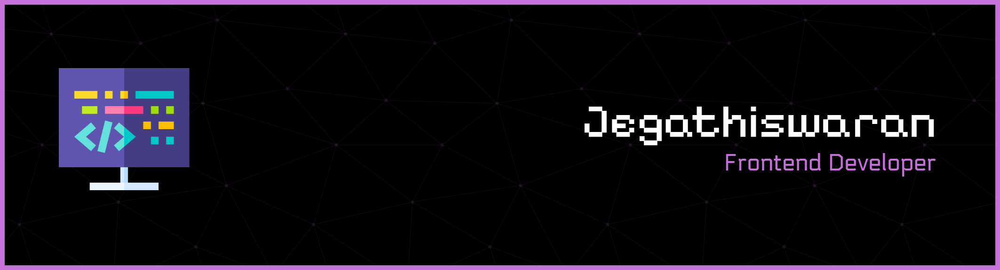
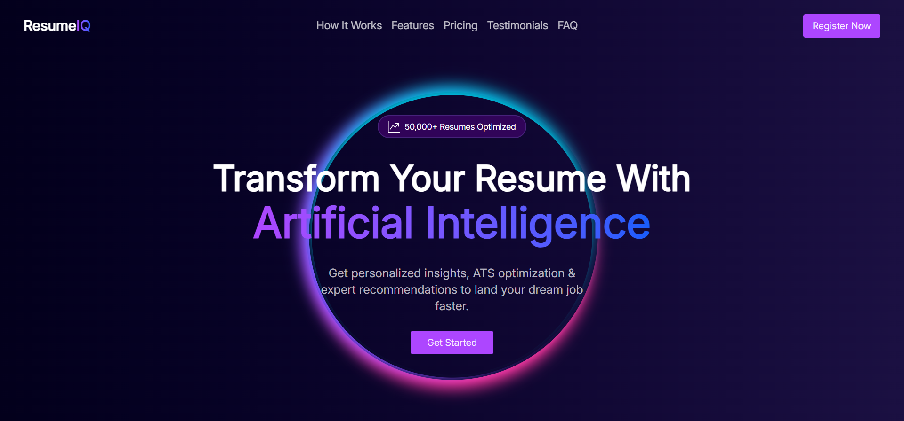
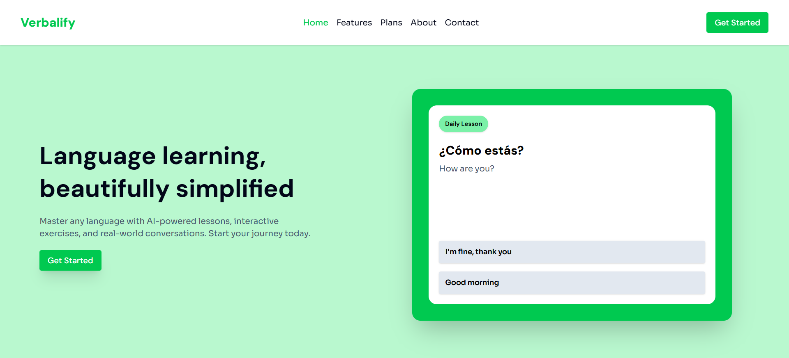
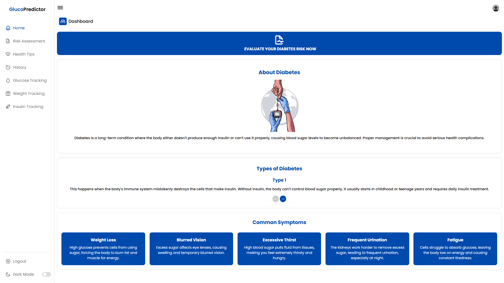
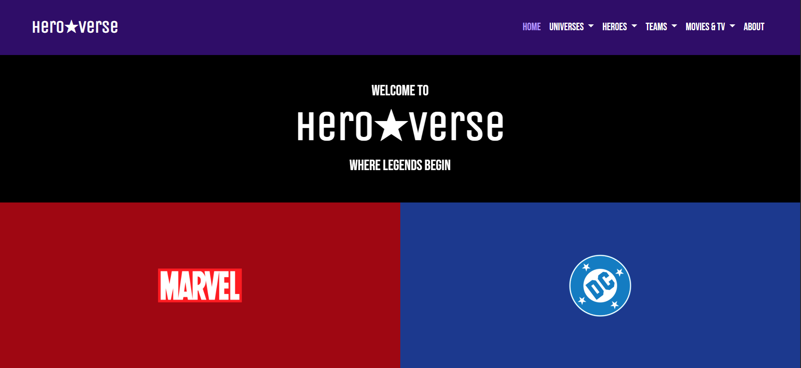

 

  <b>Hi there, I'm Jegathiswaran 👋</b>

  💻 Frontend Developer

  🎓 Bachelor of Information Technology (Hons) student

  💼 Completed Frontend Developer Internship at 

  👨‍💻 Currently learning React.js

 

---

## 🚀 Featured Projects

### ResumeIQ
Fictional AI Resume Optimization SaaS Marketing Landing Page 📝🧠

🔗 Live Demo: https://resumeiq-jega1312.vercel.app/  
📂 GitHub Repo: https://github.com/jega1312/resumeiq

**Tech Used:** React · React Hook Form · Tailwind CSS · Swiper.js · Framer Motion · Random User API 

 

### Verbalify
Fictional AI Language Learning Platform Marketing Multi-Page Website 🌐🗣

🔗 Live Demo: https://verbalify-jega1312.vercel.app/  
📂 GitHub Repo: https://github.com/jega1312/verbalify

**Tech Used:** React · React Router · React Hook Form · React Helmet Async · Tailwind CSS · Swiper.js · Framer Motion · Random User API 

 

### Spice Haven
Fictional Luxury Fine Dining Restaurant WordPress Website ⭐🍽

🔗 Live Demo: https://spicehaven.infinityfreeapp.com/   
📂 GitHub Repo: https://github.com/jega1312/spicehaven

**Tech Used:** WordPress · Elementor · WPCode

 

### GlucoPredictor (Final-Year Project)
Diabetes Risk Assessment System with Rule/AI-Based Health Tips Web Application 🩺📊   
🏆 **Received Excellent Final-Year Project Award by City University Malaysia in April 2025**

🔗 Live Demo: **Hosted Locally**   
📂 GitHub Repo: https://github.com/jega1312/glucopredictor

**Tech Used:** HTML · CSS · JavaScript · Bootstrap · PHP · MySQL · phpMyAdmin · Python · Jupyter Notebook 

 

### HeroVerse
Fan-Made Marvel & DC Universe Fan Information Hub Website 🦸‍♂️⚡

🔗 Live Demo: https://heroverse-jega1312.vercel.app/   
📂 GitHub Repo: https://github.com/jega1312/heroverse

**Tech Used:** HTML · Bootstrap · SASS/SCSS · JavaScript · Owl Carousel · Animate.css

 

---

## 🔗 Reach Me
  

 

---

## 💻 Tech Stack
          

 

---

## 📊 GitHub Stats
  
  

 

---

## 📈 GitHub Contribution Graph

 

---

✨ Always learning, always building, always growing.

 
